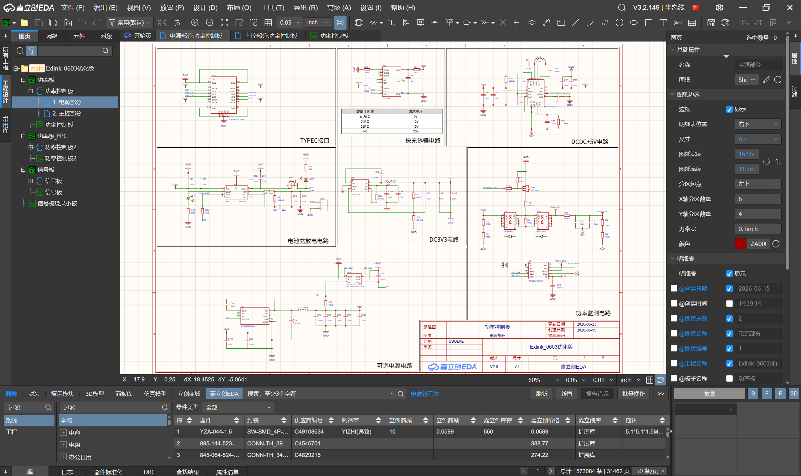
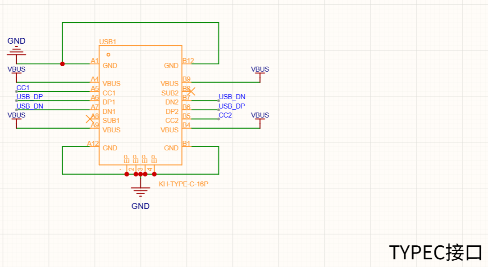
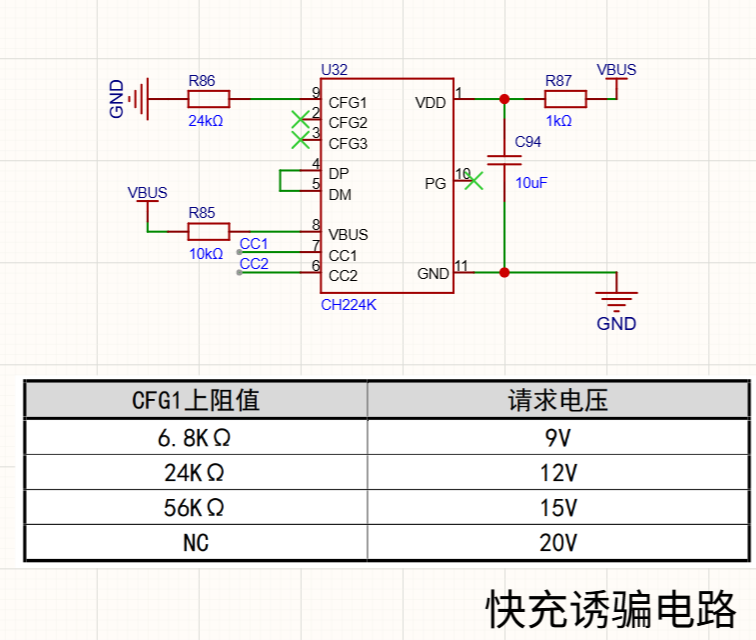
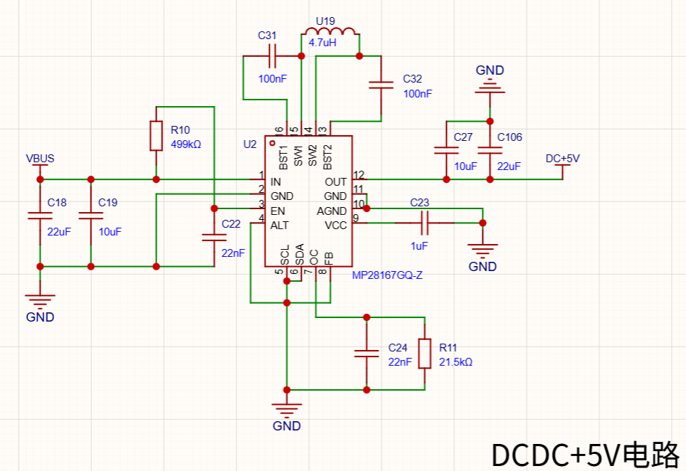
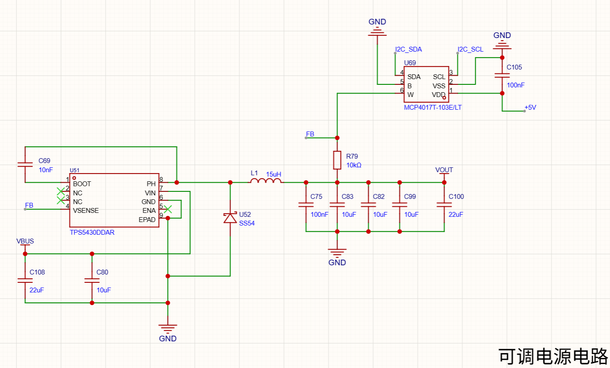
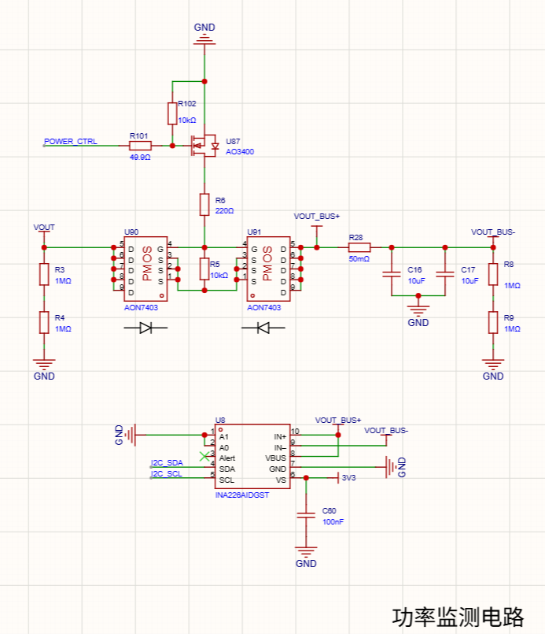
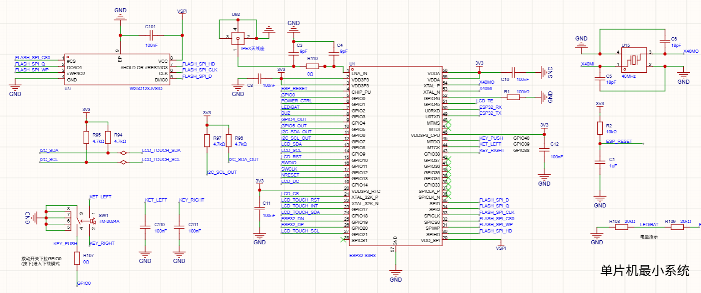
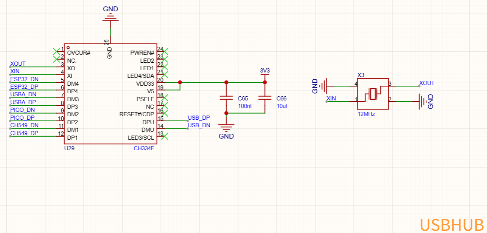
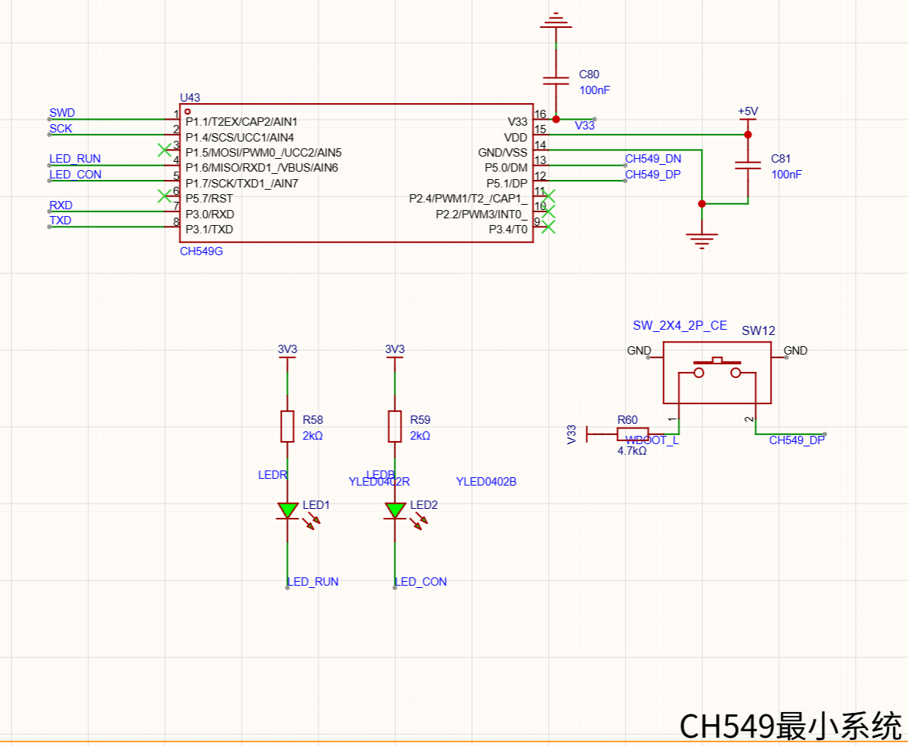
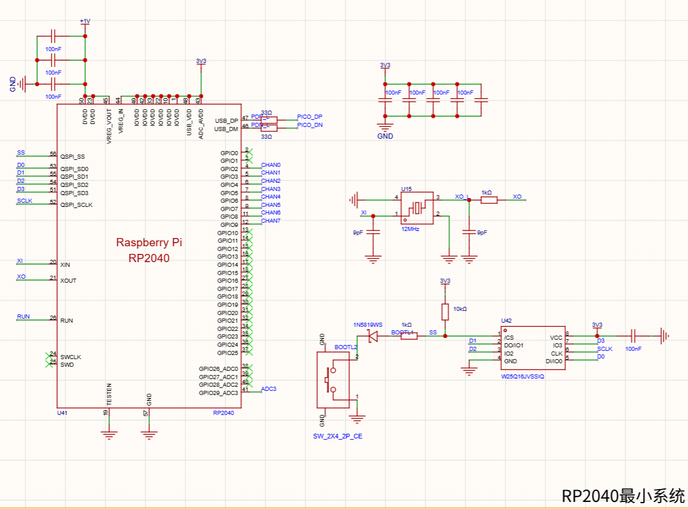

# 01 · 电路图的学习：把复杂板子拆成能理解的模块

[← 上一章：前言](00-preface.md) · [返回首页](../README.md) · [下一章：板子的焊接 →](02-soldering.md)

## 本章起点

第一次打开 Exlink 原理图时，我看到的是大量器件、网络名和交叉连接。作为一个习惯从 `main()` 或入口函数开始读程序的人，我下意识地想寻找电路图的“第一行”，后来才意识到：原理图不是按页面顺序执行的代码，更适合按照能量流、信号流和功能模块来阅读。

我认为，原理图和 PCB 布局布线图是读懂硬件设计的重要入口。在朋友的推荐下，我开始使用嘉立创 EDA 阅读 Exlink 的工程文件。原理图描述器件之间的连接关系，PCB 图则展示元件在板上的实际位置和走线；把两者对照起来，我才逐渐看出整块电路板可以怎样拆分成不同模块，以及这些模块之间如何相互配合。



*在嘉立创 EDA 中打开的 Exlink 功率控制板原理图。作者已经按功能划分了电路区域，这给我提供了一个很清晰的阅读起点。*<sub><sub><sub><sub><sub><sub>使用立创喵，使用立创谢谢喵～</sub></sub></sub></sub></sub></sub>  

<br><br>

真正让我开始看懂它的转折点，是不再试图一次理解整块板子，而是先问三个问题：这个模块的电从哪里来？它和谁通信？它的输出去了哪里？

## 我怎样拆分整套硬件

我先把 Exlink 分成四个层次：

1. **电源部分**：处理 Type-C 输入和电池充放电，并为各个模块提供需要的电压。
2. **功率闭环控制**：调节输出电压，控制输出通断，同时监测电压、电流和功率。
3. **主控与人机交互**：以 ESP32-S3 为核心，连接 Flash、USB Hub、屏幕、触摸、按键和蜂鸣器。
4. **信号板**：由 CH549 和 RP2040 分别承担 DAPLink、逻辑分析等功能。
## 电源处理

电源部分负责处理 Type-C 输入、电池充放电以及 5V、3.3V 等电源转换，为整机各模块提供稳定供电。



*Type-C 输入接口，负责接入外部电源。*



*CH224K 快充诱骗电路，通过 PD 协议申请项目需要的输入电压。*



*5V DC-DC 电路，将输入电压转换成后续电路需要的稳定 5V。*

```text
Type-C 输入
  -> CH224K 协商需要的输入电压
  -> DC-DC 产生稳定的 5V
  -> 降压电路产生 3.3V
  -> 各芯片和接口获得自己的工作电源
```

IP5306 负责电池的充放电管理，使设备也能够通过电池供电。

## 功率闭环控制

可调电源与功率监测不属于整机的基础供电，而是专门服务于 VOUT 输出。两部分共同完成电压调节、输出通断和状态监测，并为输出保护提供信息与控制手段。



*可调电源电路：TPS5430 产生 VOUT，MCP4017 改变反馈条件，从而调节输出电压。*



*功率监测电路：MOS 管控制输出通断，INA226 负责测量输出电压、电流和功率。*

其中，TPS5430 及其反馈网络构成硬件电压闭环；INA226 主要负责监测，并不直接等同于软件自动调压闭环。

## 主控与人机交互

主控部分以 ESP32-S3 为核心，负责程序运行、界面显示、触摸与按键交互，并与各类外设通信。



*ESP32-S3 最小系统，包括供电、复位、晶振、外部 Flash 和启动配置。*



*CH334F USB Hub 将电脑的一条 USB 连接扩展给设备内部的多个功能单元。*

## 信号板

信号板集成了 DAPLink 和逻辑分析功能，与功率控制板配合组成完整的调试工具。



*CH549 最小系统，烧录相应固件后承担 DAPLink 功能。*



*RP2040 最小系统，烧录相应固件后承担逻辑分析功能。*

## 我的学习过程

整个工程的电路图非常复杂。与其直接面对整张图，我逐渐形成了一条更适合自己的学习路线：先理解已经划分好的原理图模块，再到 PCB 图中寻找对应位置；遇到不认识的元件就查询数据手册，然后结合各模块之间的连接，尝试理解整块板子是怎样协同工作的。

### 先理解已经分好的原理图模块

Exlink 的原理图已经按照功能划分成不同区域，这大大降低了阅读难度。我会先单独看一个模块，弄清楚它大致有什么作用、输入从哪里来、输出又去了哪里，而不是一开始就试图理解全部元件和连线。

有了模块的基本概念之后，再去看它和其他部分共享了哪些电源、控制信号或通信总线，原本分散的电路才会逐渐连接成一个完整系统。

### 再与 PCB 布局布线图对照

只看原理图，我知道的是器件在电气上如何连接，却不知道它们在真实电路板上的位置。把原理图和 PCB 布局布线图同步对照后，我可以寻找每个模块对应的器件和走线，了解图纸上的连接最后是怎样落实到焊盘和铜线上的。

这种对照也为后面的焊接和排查做了准备：当某个功能出现问题时，我至少知道应该在板子的哪一片区域寻找相关元件。

### 把数据手册当作元件说明书

原理图标出了元件的具体型号，这让我能够继续查找对应的数据手册。对我来说，数据手册就像元件的说明书，可以用来确认供电、引脚、封装、启动条件和典型应用等信息。

数据手册通常很长，我并不会强迫自己从第一页读到最后一页，而是带着当时的问题按需查找：

- 芯片允许的供电电压是多少？
- 封装上的 1 脚在哪里，原理图符号如何对应实物？
- 哪些引脚影响启动和烧录模式？
- 典型应用电路需要哪些外围元件？
- 某个信号是输入、输出、开漏还是差分信号？

数据手册也可以作为提供给 AI 的参考资料。相比只给出一个芯片型号，让 AI 先阅读对应手册再围绕具体问题讲解，得到的回答通常更有依据，也更容易和原理图相互验证。

### 善用AI

在学习各个模块以及它们之间如何联动时，AI 给了我很大帮助。大部分模块都可以截取原理图，再连同相关数据手册一起提供给 AI，让它解释电源和信号的流向，以及各个元件可能承担的作用。

不过，AI 的回答仍然需要自己判断。它有时会给出模棱两可的结论，也可能补充一些原理图中并没有直接体现的细节。我的另一个感受是，现在的 AI 往往能够覆盖很多信息，但也很容易输出过多的冗余内容。因此，我需要根据自己的问题进行删减，并回到原理图、数据手册或实际测量中确认关键结论。

对我来说，比较合适的方式是让 AI 帮我读资料、梳理思路，但不让它替代最后的判断。

### 感兴趣时再继续向下深入

在大致看懂一个模块以后，还可以继续了解其中元件的工作原理，以及背后的通信协议和数字、模拟电路知识。Exlink 让我接触到的方向包括：

| 名称 | 在这个项目中看到的作用 |
| --- | --- |
| GPIO | 由程序配置的引脚，实际用途还会受到原理图连接的影响 |
| I²C | 让多个低速外设共享通信线路，需要关注地址和上拉电阻 |
| SPI | 通过时钟、数据和片选连接 Flash、显示等外设 |
| UART | 用于串行收发，也可以输出帮助排查问题的日志 |
| USB | 除了接口本身，还涉及差分信号、设备识别和驱动 |
| ADC | 把真实电压转换成程序能够读取的数值 |

这些内容不一定要在第一次读图时全部弄懂。可以先围绕当前模块解决最直接的问题，当然也可以去 B 站、YouTube 等视频网站寻找更直观的原理讲解。


## 本章图片说明

本章已使用的电路截图来自 Exlink 开源原理图，我按自己的学习过程拆分为功能块，仅用于说明个人理解。原始设计及原理图权利归原作者所有。

后续还可以补充：

- 嘉立创 EDA 中的网络追踪过程；
- 自己在数据手册上做的标记；
- 电源、USB 和通信链路的手绘草图；
- 原理图与 PCB 实物位置的对照图。

## 阶段小结

我在这一阶段最大的收获，不是记住了多少芯片型号，而是开始尝试把复杂硬件拆成电源、功率控制、主控交互和信号板四个能够分别追踪的问题。对这些模块有了初步认识之后，焊接对我来说也不再只是把元件放到焊盘上，而是在逐步实现并验证原理图中的功能。

---

[← 上一章：00 · 前言](00-preface.md) · [返回首页](../README.md) · [下一章：02 · 板子的焊接 →](02-soldering.md)
