**Language / 语言:** [中文](02-soldering.md) · **English**

# 02 · Soldering the Boards: Turning Drawings into Hardware for the First Time

[← Previous: Learning to Read the Schematics](01-schematic.en.md) · [Back to home](../README.en.md) · [Next: Flashing the Firmware →](03-flashing.en.md)

## Where I Started

Once I could roughly follow the schematics, it was time to put my soldering skills to the test. Honestly, the first sight of those tiny components left me a little stunned:

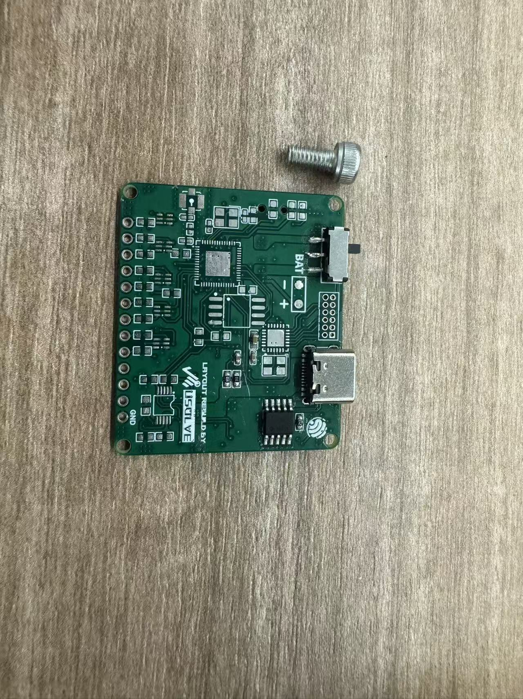

*Figure 1: Surface-mount components on the PCB, with a screw beside them for scale.*

I had not realized resistors and capacitors could be so small. The capacitors I had pictured looked much more like this:

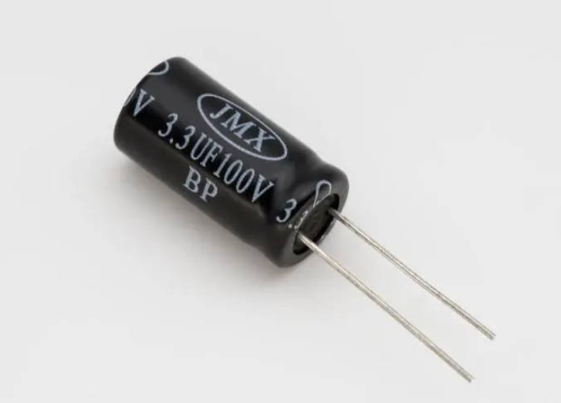

*Figure 2: A through-hole electrolytic capacitor of the kind I knew better before this build.*

## Tools and Materials

| Tool or material | What I used it for |
| --- | --- |
| Soldering iron | Tacking parts in place, touching up joints, drag soldering, and local rework |
| Hot-air station | Heating an area at once, useful for soldering or reworking QFN chips and Type-C connectors; it takes relatively long to heat up, but can work on several joints together |
| Solder paste and solder wire | Supplying solder; paste was surprisingly handy, with flux already in it, especially for surface-mount work with hot air |
| Flux | Improving solder wetting and flow during drag soldering, touch-ups, and removal of solder bridges |
| Tweezers and magnification | Placing and aligning parts, then checking for bridges, cold joints, and wrong orientations |
| Multimeter | Checking for shorts before power-up and measuring supply rails and signals afterward |
| PCB cleaner | Removing flux, solder balls, and other residue from the board |
| Desoldering braid | Removing excess solder from pads and pins |

## Those Tiny Packages!

For a beginner, 0603 and 0402 packages, Type-C connectors, and QFN chips all demand real hand-eye coordination. I had to keep my eyes on those very, very tiny pins. Without a board holder (I would recommend one), I also had to steady the board or part with one hand while working the iron and solder paste with the other. The whole process required as steady a hand as I could manage.

In practice, it was a little taxing, both physically and mentally.

## Problems to Watch For and How to Address Them

These are some of the issues I encountered or paid particular attention to while troubleshooting:

| Symptom | Check or remedy |
| --- | --- |
| Solder bridges between pins | Add flux first, then gently drag a clean iron tip along the pins. If there is still too much solder, remove the excess with desoldering braid. |
| A chip has poor solder joints | Check that the pins and underside pad have actually taken solder. Use an appropriate amount of paste under the chip and heat it fully and evenly; attached outer pins alone do not prove that the underside is soldered. |
| The buzzer sounds continuously during a power-on test | Check whether the INA226 is missing or poorly soldered, and whether its power and I²C connections are sound. The firmware I used keeps retrying when it cannot detect the INA226, so initialization cannot continue. |
| The screen has a backlight but no image | Check the FPC ribbon cable and connector first. Excessive hot-air temperature may deform the connector; if it is damaged, replacing it is the practical fix. |

> [!CAUTION]
> Disconnect USB, the battery, and any other power source before rework or continuity checks. After each stage, inspect for shorts and solder-joint problems before powering the board.

## The Broad Sequence

For the exact soldering order, I recommend the [revised Exlink tutorial series listed in the README](../README.en.md#references-and-thanks). The videos already explain each step in detail. I followed them as I built the boards; the photos below are a brief record of my own progress.

| Figure 3 | Figure 4 |
| --- | --- |
| 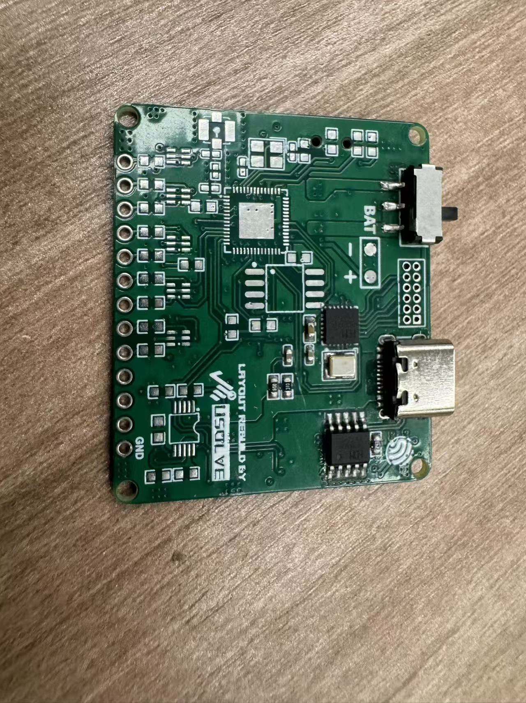 | 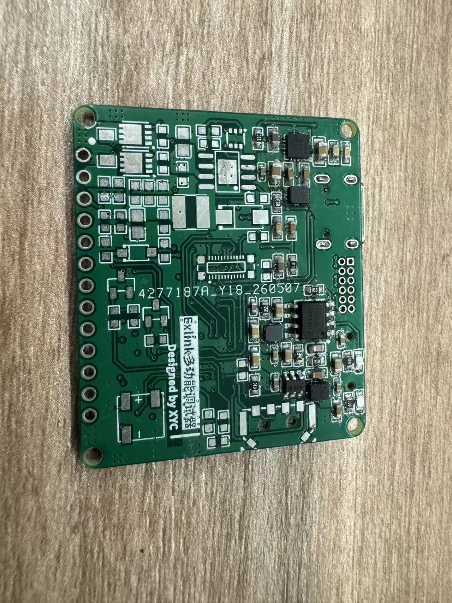 |
| Starting on the front of the power-control board. | Gradually populating the power-related parts on the back. |

| Figure 5 | Figure 6 |
| --- | --- |
| 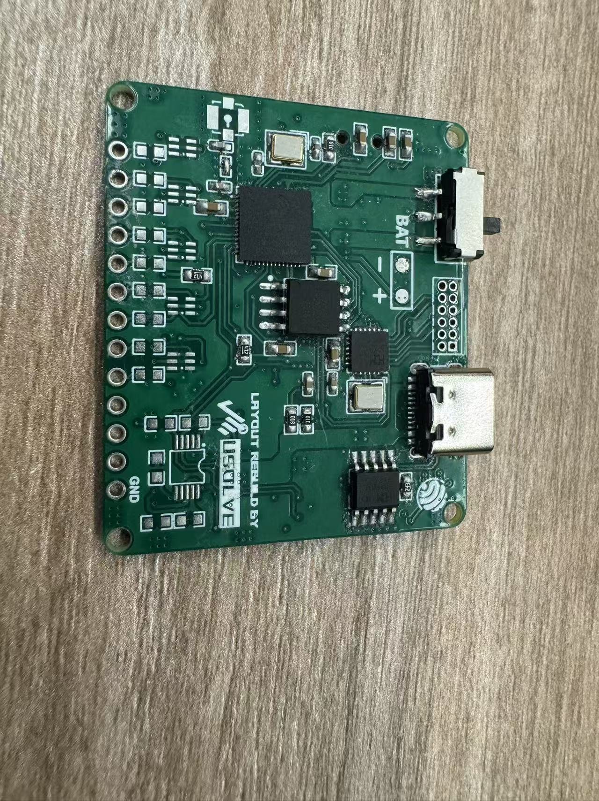 | 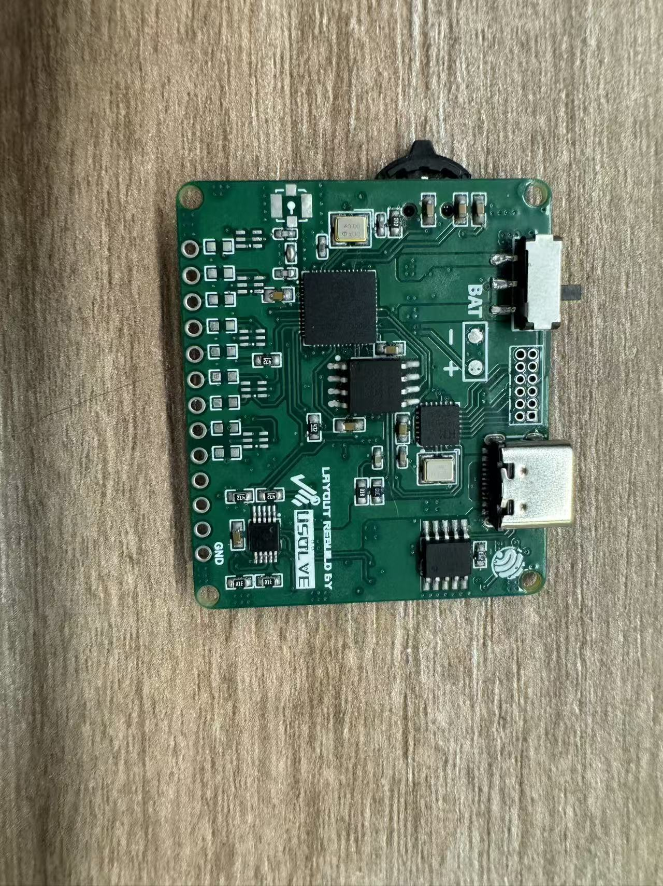 |
| Continuing with the main controller and surrounding parts. | Adding more connectors and peripheral circuits. |

| Figure 7 | Figure 8 |
| --- | --- |
| 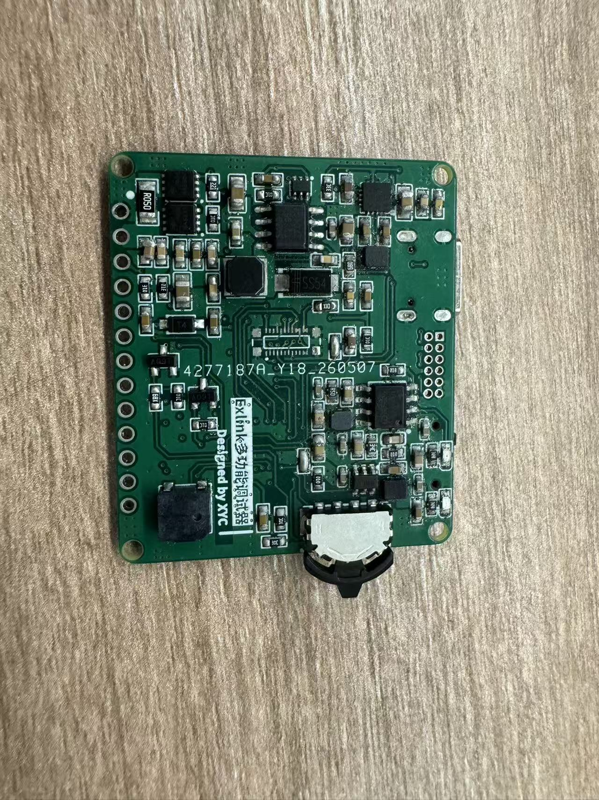 | 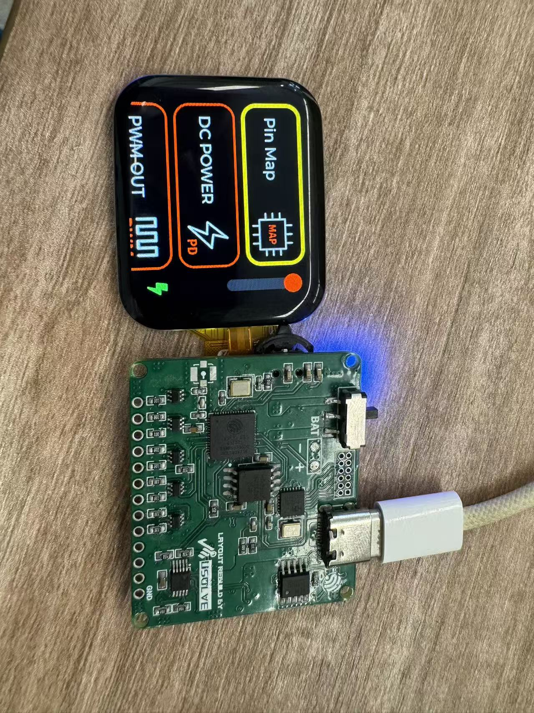 |
| The back of the power-control board was nearly complete. | After connecting the screen, the main interface appeared. |

| Figure 9 | Figure 10 |
| --- | --- |
| 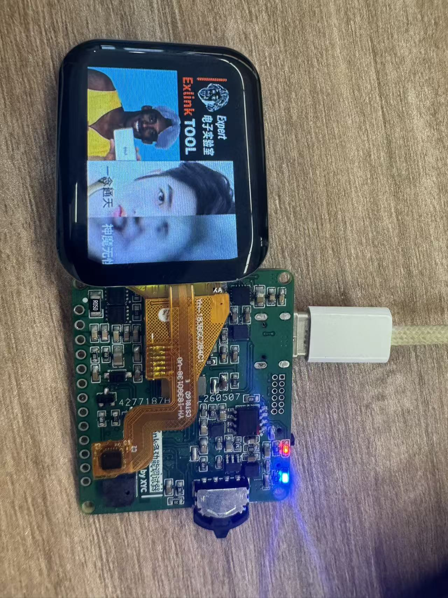 | 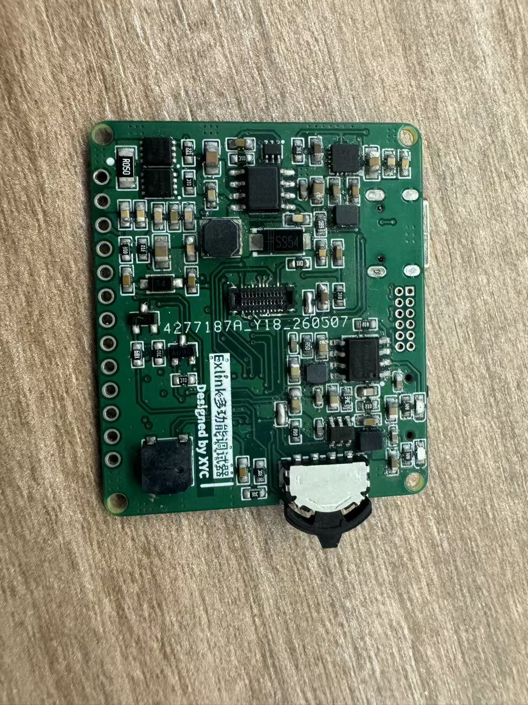 |
| Continuing to test the display and onboard indicators. | The completed back of the power-control board. |

| Figure 11 | Figure 12 |
| --- | --- |
| 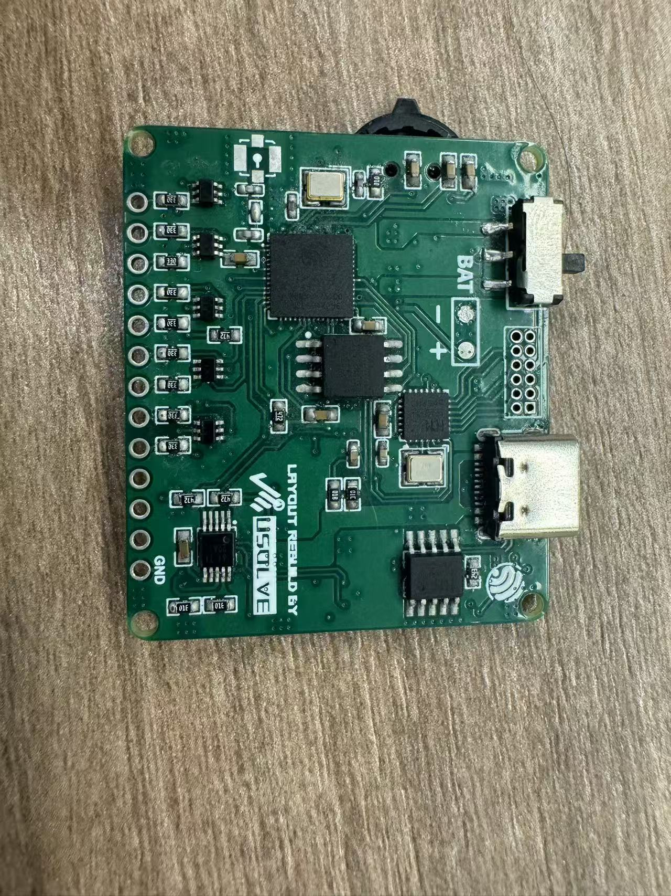 | 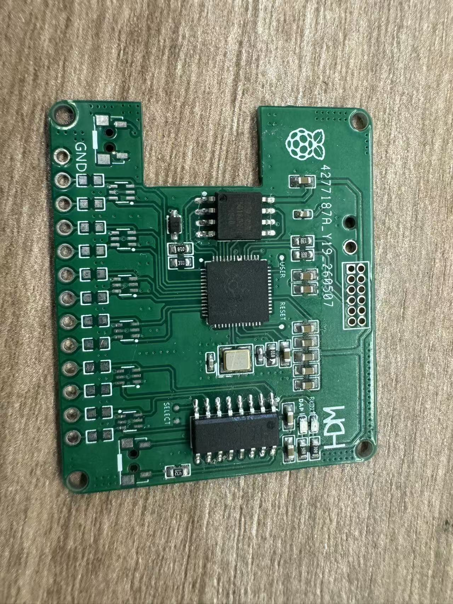 |
| The completed front of the power-control board. | The signal board's main chips and basic components in place. |

### The Signal Board Is Complete

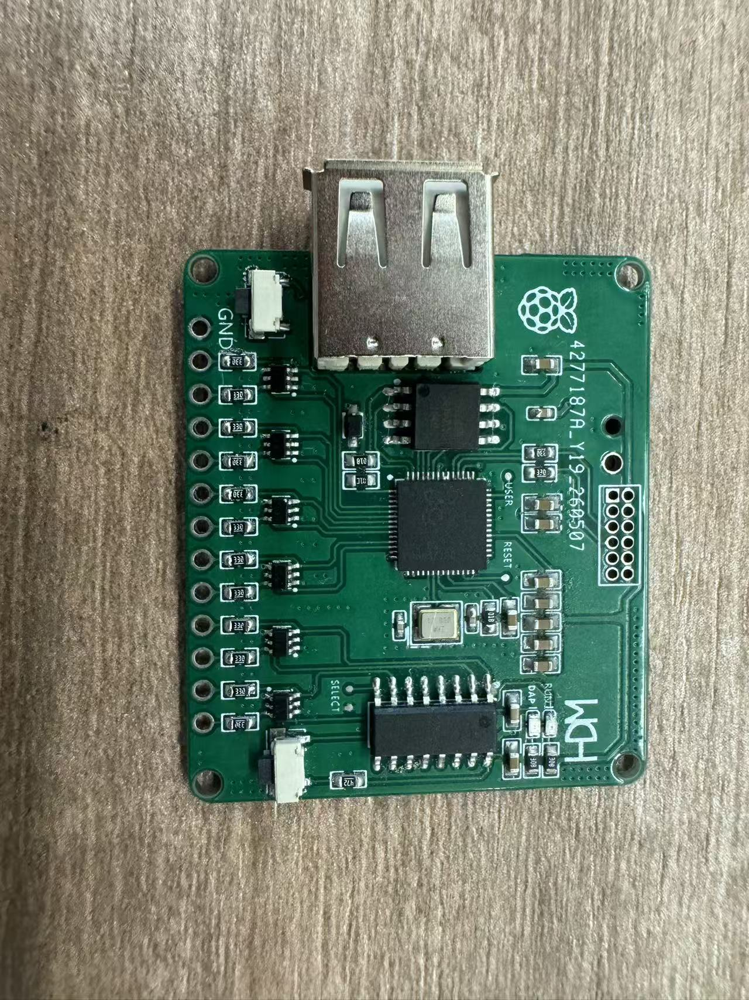

*Figure 13: The signal board after adding the USB connector, switch, and remaining components.*

## What I Took Away

Soldering was not simply a matter of fitting every component in one sitting. Working by function, checking each stage, and only then applying power took more time, but made faults easier to narrow down. The biggest change for me was that I could now connect the schematics from the previous chapter to the real board in my hands, piece by piece.

---

[← Previous: 01 · Learning to Read the Schematics](01-schematic.en.md) · [Back to home](../README.en.md) · [Next: 03 · Flashing the Firmware →](03-flashing.en.md)

**Language / 语言:** [中文](02-soldering.md) · **English**
