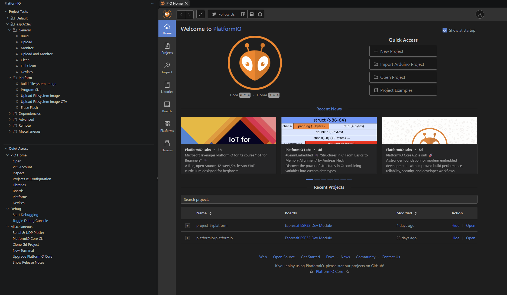
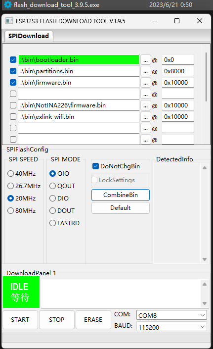
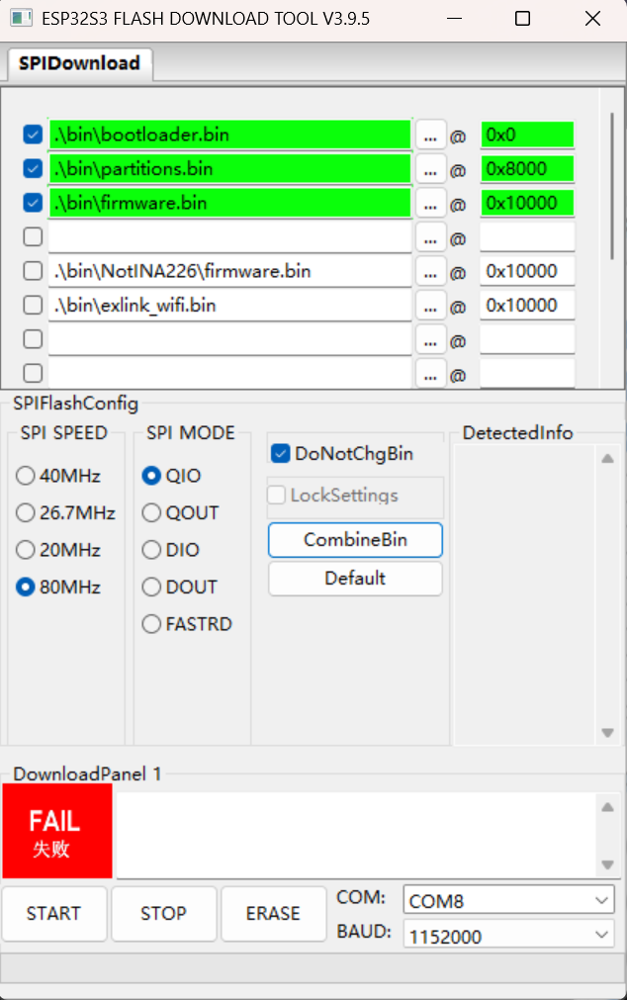
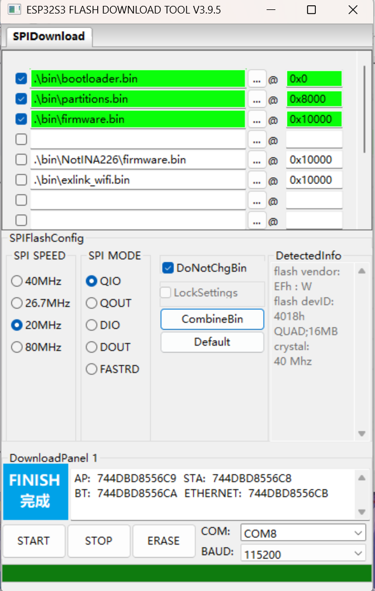
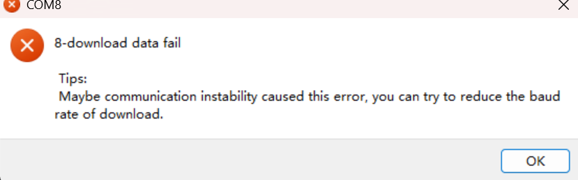
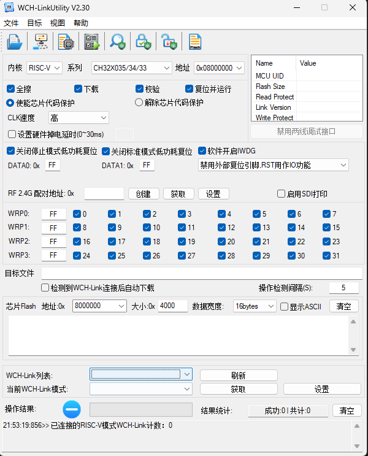
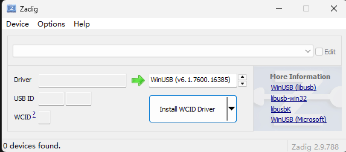
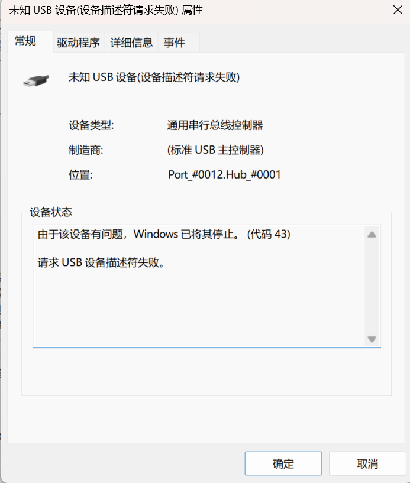

**语言 / Language：** **中文** · [English](03-flashing.en.md)

# 03 · 程序的烧录：让电路真正运行起来

[← 上一章：板子的焊接](02-soldering.md) · [返回首页](../README.md) · [下一章：最后的组装 →](04-assembly.md)

## 本章起点

当电路板焊接完成，整个项目的底层硬件基础就算搭好了。但 ESP32-S3、CH549 和 RP2040 还需要分别烧录固件，才能真正工作；烧录时也要确保它们与电脑正确连接，并配置合适的驱动。

这一部分在我看来正是软件和硬件的边界：人写下的源代码经过编译和链接，变成由 0 和 1 组成的固件，再写入芯片作为高低电平储存起来。至此，原本抽象的程序开始驱动眼前的电路，软硬件之间的联系也变得具体。

## 三颗芯片、三种职责

| 芯片 | 主要职责 |
| --- | --- |
| ESP32-S3 | 运行主界面，处理交互并协调多项工具功能 |
| CH549 | 承担信号板上的 DAPLink 调试功能 |
| RP2040 | 承担逻辑分析仪的信号采集功能 |

三颗单片机带来一定的硬件开销，但分工清晰：ESP32-S3 是主控，另外两颗分别处理调试和采样任务，避免把所有功能都塞进一颗芯片。它们协同构成的是一套嵌入式调试工具，而不是通常意义上的操作系统。

## 烧录从启动模式开始

**Boot（启动）模式**决定芯片在复位后先做什么。以 ESP32-S3 为例，启动配置引脚的状态决定它正常启动，还是进入芯片 ROM 中的下载程序、等待电脑写入固件。**Bootloader（引导程序）**负责把控制权交给后续程序：正常启动时，芯片先运行固化在 ROM 中的启动代码，再从外部 Flash 读取二级 Bootloader；后者依据分区表找到并加载应用程序。**Flash** 则是断电后仍能保留数据的存储器，板上的 Bootloader、分区表和应用固件都存放在其中。

这一部分的学习也参考了 [Bootloader 与启动过程讲解视频](https://www.bilibili.com/video/BV1AN411R7Be/)。

于是，“点一下烧录按钮”背后其实有一条完整的链路：

```text
源代码 → 编译、链接 → 固件映像
                         ↓
电脑识别下载模式设备 → USB 传输 → 写入 Flash
                                      ↓
                         复位 → 启动代码加载应用程序
```

如果直接使用现成的 `.bin` 或 `.uf2` 固件，就从“固件映像”这一步开始；文件仍须与目标芯片、板上硬件和写入位置相匹配。下面三颗芯片的进入方式、烧录工具和运行后的设备形态并不完全相同。

## ESP32-S3：工程与成品固件

ESP32-S3 的源码工程使用 PlatformIO。项目中的 `platformio.ini` 指定了 `esp32s3` 环境、Arduino 框架、分区表、PSRAM 配置和 16 MB Flash：

```ini
[env:esp32s3]
platform = espressif32 @ 6.5.0
board = esp32-s3-devkitc-1
framework = arduino
board_build.arduino.partitions = my.csv
board_build.arduino.memory_type = qio_opi
build_flags = -DBOARD_HAS_PSRAM
board_upload.flash_size = 16MB
```

PlatformIO 把工程配置、依赖和常用操作集中在一起。`Build` 用来编译源码并生成固件，`Upload` 将编译结果写入开发板，`Monitor` 查看串口输出，`Upload and Monitor` 则在上传后打开监视器。排查“程序是否真的运行”时，串口输出尤其有用；若要修改功能，也可以从这个工程重新编译。下图是本地 PlatformIO 界面，左侧列出了这些任务。



*图 1：PlatformIO 的 Build、Upload、Monitor 等任务。*

不过，这次实际给板子烧录时，我使用的是资料中已经编译好的 `.bin` 文件，通过资料自带的 **Espressif Flash Download Tool** 写入，而不是在 PlatformIO 中重新编译上传。这样也区分了两件事：PlatformIO 是理解和修改工程的入口；这次的烧录则从现成固件开始。

资料中的工具选择 `ESP32-S3`、`Develop` 和 `UART` 后，按配套截图设置三个文件的地址：

| 文件 | 写入地址 | 作用 |
| --- | --- | --- |
| `bootloader.bin` | `0x0` | 二级 Bootloader |
| `partitions.bin` | `0x8000` | 分区表 |
| `firmware.bin` | `0x10000` | 应用程序 |

这些地址对应**本项目所附的固件组合**，不能脱离分区配置套用到别的工程。选好实际连接的 COM 口后，确认 ESP32-S3 已进入下载模式，再开始写入。若板子没有自动进入下载模式，应检查其 BOOT/复位操作和 USB 连接；写入完成后复位，观察屏幕或串口输出确认程序启动。



*图 2：本次使用的烧录工具及三份 `.bin` 文件的写入地址。*

烧录时我也遇到过失败提示。工具报过 `8-download data fail`，并建议降低下载波特率。此类提示首先要检查端口、下载模式和连接稳定性；若通信不稳，可以把波特率调低后重试。工具显示 `FINISH` 说明写入完成，但最终还要以复位后能否正常运行来判断。

| 下载失败 | 写入完成 |
| --- | --- |
|  |  |
| 图 3：工具显示 `FAIL`，需要回查连接和下载设置。 | 图 4：工具显示 `FINISH`，随后还应检查启动结果。 |



*图 5：通信不稳定时，工具提示尝试降低下载波特率。*

## CH549：写入 DAPLink 固件

CH549 承担信号板的 DAPLink 功能。烧录大致分两段：先让芯片进入下载模式，用 **WCHISPTool** 写入引导固件；再通过 **WCH-LinkUtility** 检查连接并切换到 DAPLink 模式。引导固件写入成功后，还要确认电脑能识别调试接口。

信号板有独立的 DAPLink 烧录按键；如果电脑找不到设备，还需检查按键、USB 连接和驱动。相关操作可参见 [Exlink 优化版信号板焊接与调试视频](https://www.bilibili.com/video/BV1c41yBkELs/)。



*图 6：WCH-LinkUtility 用于识别设备并切换运行模式；首次引导烧录使用 WCHISPTool。*

## RP2040：UF2 与逻辑分析仪

RP2040 的烧录更直观：按住烧录键接入 USB，电脑会将它识别为 `RPI-RP2` 存储设备；复制 UF2 固件后，芯片自动重启，盘符随之消失。这也让我直观地看到，同一个 USB 接口在烧录和运行阶段可以呈现不同的设备身份。

写入固件后，电脑还需要正确识别逻辑分析仪，并由 **PulseView** 连接使用。若 PulseView 找不到设备，应先在设备管理器中检查运行后的串口与驱动，再核对软件选择的设备和端口。烧录成功、设备被识别、上位机能够采样，是三个需要分别确认的阶段。



*图 7：Zadig 的驱动选择界面；配置驱动时需核对目标设备。*


## 常见问题与可能原因

| 现象 | 可能原因 |
| --- | --- |
| 设备管理器显示“未知 USB 设备（设备描述符请求失败）”，代码 43 | USB 枚举未完成，可能与连接、供电或 USB 电路有关；仅凭截图无法断定是 Hub 故障。 |
| ESP32-S3 烧录时报 `FAIL` 或 `8-download data fail` | 下载模式、串口连接或传输稳定性有问题；下载波特率过高也可能导致通信失败。 |
| 写入完成，但复位后无法正常启动或读取 Flash 报错 | 固件文件与写入地址不匹配，或 Flash 访问配置（如 `SPI SPEED`）不适合当前硬件。 |
| 电脑找不到 CH549 或 RP2040 对应的设备 | 可能未进入正确模式，或设备已枚举但缺少对应驱动。 |
| RP2040 的 `RPI-RP2` 盘符消失，或 PulseView 找不到设备 | UF2 写入后盘符消失是正常现象；PulseView 找不到设备时再核对驱动和串口。 |

以下是可以参考的其他资料：[Espressif Flash Download Tool 说明](https://docs.espressif.com/projects/esp-test-tools/en/latest/esp32/production_stage/tools/flash_download_tool.html) 和 [ESP32-S3 的 SPI Flash 模式说明](https://docs.espressif.com/projects/esptool/en/latest/esp32s3/advanced-topics/spi-flash-modes.html)。排查时最好一次只改一项，再记录结果。



*图 8：设备管理器中的代码 43 与“设备描述符请求失败”。*

## 阶段小结

烧录表面上是把文件写进芯片，实际却把启动电路、存储布局、USB 通信、驱动和上位机软件都串了起来。作为初学者，我试着把思路向外延伸：追问每一步为什么必需，再去探索烧录背后的启动、通信与存储原理。最有收获的是自己终于能把软件和硬件之间的关系连上了：硬件结构限制程序如何设计和启动，软件又决定这块板子最终表现。三颗芯片各自成功运行后，这套工具才真正成为可以使用的设备。

---

[← 上一章：02 · 板子的焊接](02-soldering.md) · [返回首页](../README.md) · [下一章：04 · 最后的组装 →](04-assembly.md)

**语言 / Language：** **中文** · [English](03-flashing.en.md)
