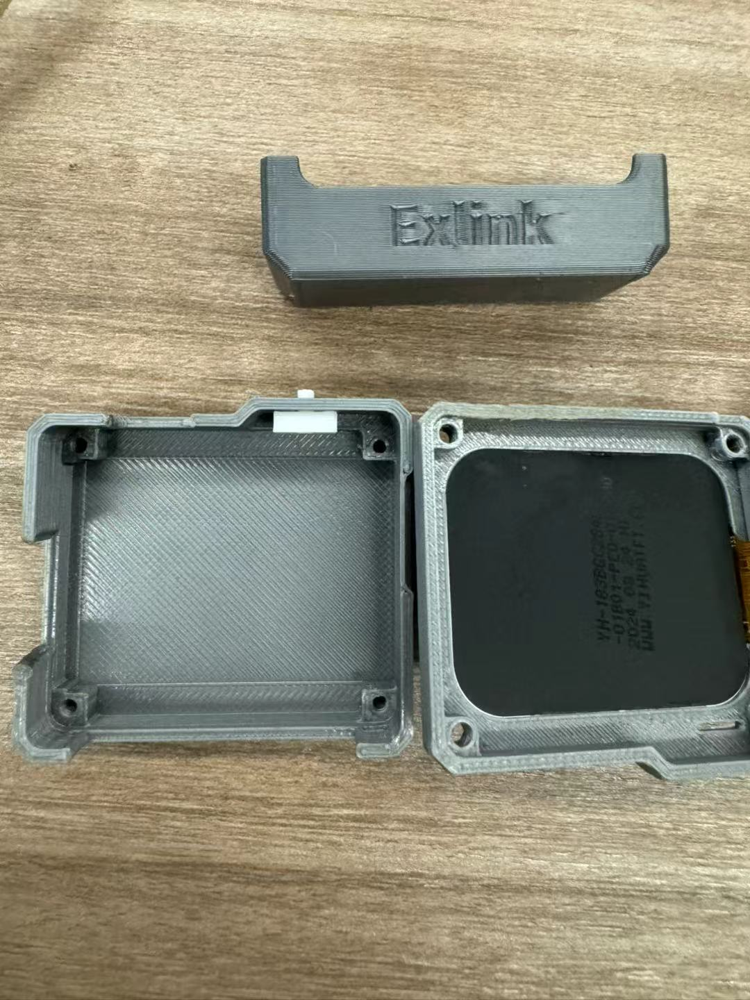
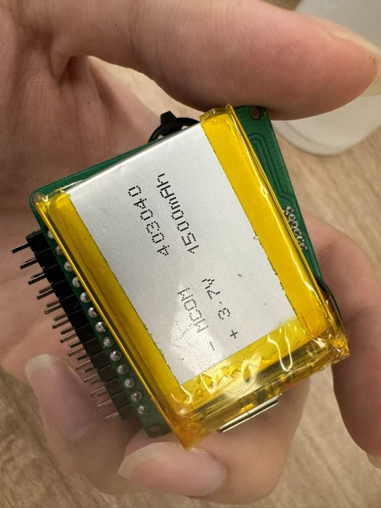
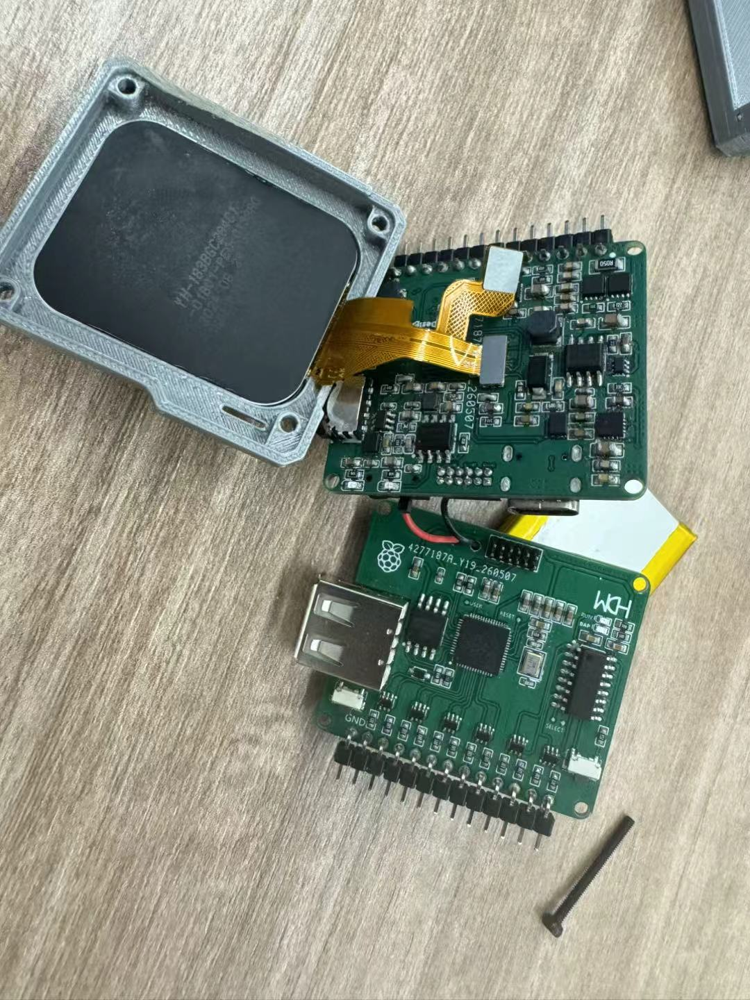
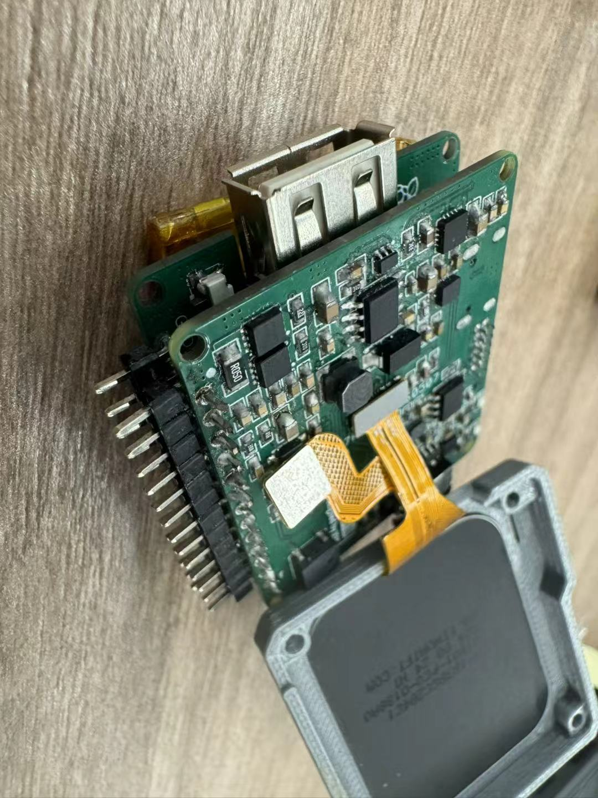
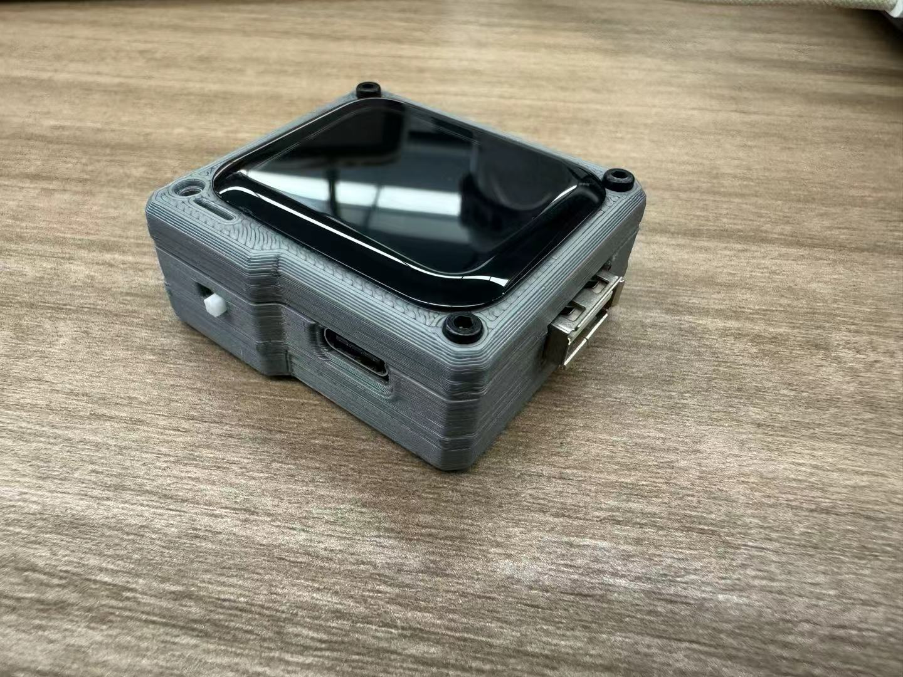

**Language / 语言:** [中文](04-assembly.md) · **English**

# 04 · Final Assembly: Making a Working Circuit into a Complete Device

[← Previous: Flashing the Firmware](03-flashing.en.md) · [Back to home](../README.en.md) · [Next: Epilogue →](05-epilogue.en.md)

## Where I Started

After soldering the boards, flashing the firmware, and passing the power-on tests, I reached final assembly. I did not spend very long on this stage. Following the sequence in the [Exlink final-assembly and debugging video](https://www.bilibili.com/video/BV1vFUMBKEbN/), the build went fairly smoothly overall. Here I mainly record the fit and clearance problems I met along the way.

## Assembly

There was not much spare room inside the supplied enclosure, so I test-fitted the enclosure, screen, boards, and battery before fixing anything in place. The battery and antenna occupied a tight area. A battery lead that was too short would not reach the power connection; one that was too long could bunch up inside and obstruct a screw hole. I therefore needed to plan the wire route first.

| Enclosure and screen | Battery test fit |
| --- | --- |
|  |  |
| Figure 1: Checking the space inside the enclosure and the screen position. | Figure 2: Testing the battery position and the clearance around the board edge, header pins, and wires. |

Next I connected the screen ribbon cable and the two boards, then checked whether they would fit together inside the enclosure. The header pins and USB connector I had were slightly different from the expected sizes. I shortened the longer ends of the header pins and locally filed down the protruding part around the USB connector before everything fitted properly.

| Connections between boards | Side clearance |
| --- | --- |
|  |  |
| Figure 3: Checking the ribbon cable and board connections before closing the case. | Figure 4: Checking from the side that the connector, header pins, and battery did not press against one another. |

Finally, I arranged the wires so that none lay along the enclosure edge or across a screw hole, then closed and fastened the case. The assembled device powered on normally. The separate screen, boards, and enclosure had finally become one complete tool.

| Finished enclosure | Powered-on display |
| --- | --- |
|  |  |
| Figure 5: The device with its enclosure closed. | Figure 6: The main interface displayed normally after power-on. |

## What I Took Away

That brought the build close to its end. Assembly itself was not complicated, but there were plenty of small details to account for. At one point I tried modifying the enclosure in SolidWorks. The STL file I had was a mesh model, though, and I could not edit it directly in the way I wanted. In the end, I used pliers and a file for small adjustments to the printed part. That experience also showed me that 3D modeling is worth learning more about when I have the time.

---

[← Previous: 03 · Flashing the Firmware](03-flashing.en.md) · [Back to home](../README.en.md) · [Next: 05 · Epilogue →](05-epilogue.en.md)

**Language / 语言:** [中文](04-assembly.md) · **English**
