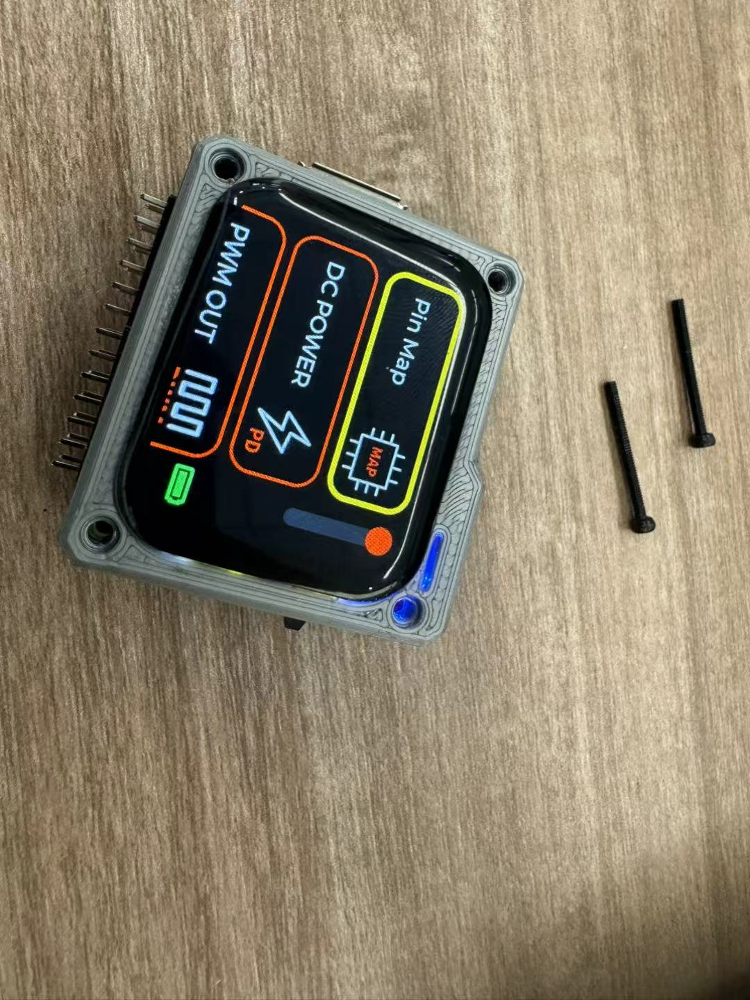

# 05 · 尾声

[← 上一章：最后的组装](04-assembly.md) · [返回首页](../README.md)

## 收获

这次从读原理图开始，经过焊接、检查、烧录固件，最后把电路板、屏幕和电池装进外壳，完整走了一遍 Exlink 的制作过程。

起初面对一块电路板，常常不知道从哪里下手。现在会先找供电、主控和接口，再对照原理图理清各部分的连接和作用：电源为芯片提供工作条件，固件控制主控如何处理输入、驱动外设，连线与接口负责传递信号。功能出了问题，也能从供电、焊点、连接和程序逐项排查。原先零散的元件、线路和代码，渐渐能放在一起理解了。

分阶段焊接、上电前检查、给几颗芯片烧录固件，以及处理组装时的连接和空间问题，也让整个制作流程有了更具体的轮廓。

## 欠缺

这次主要沿用开源设计和现成固件，电路、程序和建模方面都还有许多需要补的知识：我还尚不能独立完成电路设计与布局；源码库的内容庞大而复杂，我没能完全吃透；建模方面的技能我也不太擅长...当然以后要深入哪一块，取决于想做的项目和发展方向。至少现在遇到问题时，已经知道该往哪个方向着手并试着解决。

## 感谢开源

首先感谢 Expert 电子实验室公开 [Exlink 原版项目](https://oshwhub.com/expert/gai-jin-xin-exlink-duo-gong-neng-diao-shi-qi-fen-li-die-ban)。原理图、PCB、固件和项目说明让我有机会从一件真实作品出发，逐渐弄明白电源、主控与信号板是怎样协同工作的，而不只是对着成品猜测它的内部结构。

也感谢 usolve 在原版基础上分享 [Exlink 0603 优化版](https://oshwhub.com/usolve/exlink_0603)，对元件封装、PCB 布局和外壳等部分做了调整，并整理了复刻建议。这些改进和说明让我在焊接、排查与组装时少走了许多弯路，也更直观地感受到：开源不只是公开文件，还能让后来者继续改良，并把经验传给下一个初学者。

这篇记录只是我沿着前人铺好的路学习硬件的经历，不替代原项目的设计说明和复刻教程。其他用到的资料与致谢整理在 [README 的“主要参考与感谢”](../README.md#主要参考与感谢) 中。

## 写在最后

合上外壳、看到屏幕显示主界面的那一刻，我知道这次制作告一段落了。之前核对过的连接、烧录过的固件，最后都在这台能正常显示的 Exlink 上有了结果。我会记着初次点亮 ~~电阻~~ 屏幕时的欣喜，继续去试新的东西。

*组装完成后，屏幕显示主界面。*

---

[← 上一章：04 · 最后的组装](04-assembly.md) · [返回首页](../README.md)
